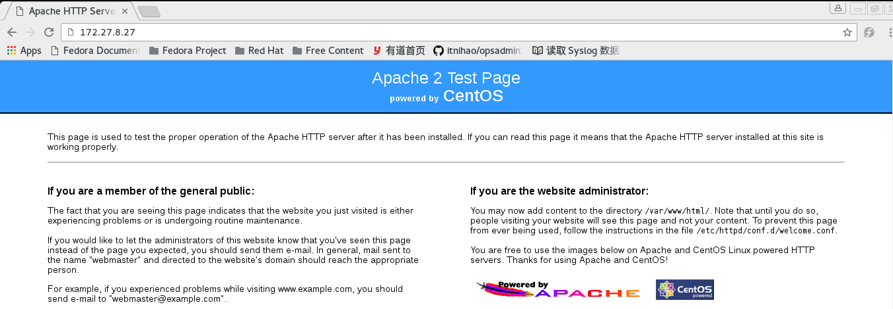
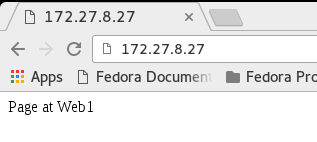
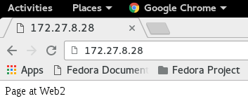
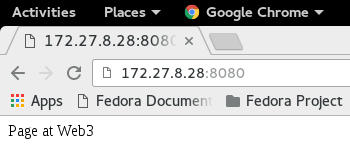
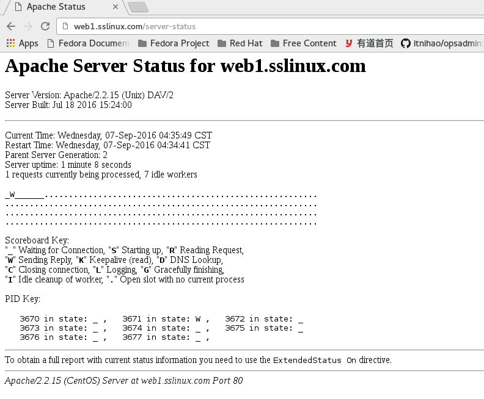

# httpd的安装配置和使用：

### httpd： apache
	a patchy server = apache
	ASF ： Apache Software Foundation
	FSF ： Free Software Foundation
	主页： http://httpd.apache.org

### httpd的特性：
- 高度模块化： core + modules
- DSO机制： Dynamic Shared Object；
- MPM： Multipath Processing Modules，多路处理模块:
~~~shell
	prefork：多进程模型，每个进程响应一个请求；
		一个主进程，负责生成n个子进程，子进程也称为工作进程，每个子进程处理一个用户请求
		即便没有用户请求，也会预先生成多个空闲进程，随时等待请求到达；最大不会超过1024个
			
	worker：多线程模型，每个线程响应一个请求；
		一个主进程，生成多个子进程，每个子进程负责生成多个线程，每个线程响应一个请求
			m进程，n线程； m*n
				
	event: event-driven,事件驱动模型，每个线程响应n个请求
		一个主进程，生成m个子进程，每个进程直接响应n个请求；
			m*n;
~~~			
httpd-2.2: event为测试使用；
httpd-2.4: event可生产使用；
		
	
### httpd的功能特性：
- **虚拟主机：**
	IP：基于IP的虚拟主机；
	Port：基于端口的虚拟主机；
	FQDN：基于域名的虚拟主机；
- **CGI：** Common Gaeway Interface，通用网关接口；
- 反向代理：
- 负载均衡：
- 路径别名：
- 丰富的用户认证机制：
	basic
	digest
- 支持第三方模块：
	
### 安装httpd
- [RPM包]()
- [源码编译安装]()

操作系统自带的版本：
CentOS 6: 2.2
CentOS 7: 2.4

### CentOS 6.6
- 查看主机是否安装了httpd程序：
~~~shell
	[root@symbio ~]# rpm -qa httpd
	httpd-2.2.15-54.el6.centos.x86_64
~~~

- 查看httpd程序安装生成的配置文件：
~~~shell
[root@symbio ~]# rpm -qc httpd
/etc/httpd/conf.d/welcome.conf
/etc/httpd/conf/httpd.conf
/etc/httpd/conf/magic
/etc/logrotate.d/httpd
/etc/sysconfig/htcacheclean
/etc/sysconfig/httpd
/var/www/error/HTTP_BAD_GATEWAY.html.var
/var/www/error/HTTP_BAD_REQUEST.html.var
/var/www/error/HTTP_FORBIDDEN.html.var
/var/www/error/HTTP_GONE.html.var
/var/www/error/HTTP_INTERNAL_SERVER_ERROR.html.var
/var/www/error/HTTP_LENGTH_REQUIRED.html.var
/var/www/error/HTTP_METHOD_NOT_ALLOWED.html.var
/var/www/error/HTTP_NOT_FOUND.html.var
/var/www/error/HTTP_NOT_IMPLEMENTED.html.var
/var/www/error/HTTP_PRECONDITION_FAILED.html.var
/var/www/error/HTTP_REQUEST_ENTITY_TOO_LARGE.html.var
/var/www/error/HTTP_REQUEST_TIME_OUT.html.var
/var/www/error/HTTP_REQUEST_URI_TOO_LARGE.html.var
/var/www/error/HTTP_SERVICE_UNAVAILABLE.html.var
/var/www/error/HTTP_UNAUTHORIZED.html.var
/var/www/error/HTTP_UNSUPPORTED_MEDIA_TYPE.html.var
/var/www/error/HTTP_VARIANT_ALSO_VARIES.html.var
/var/www/error/contact.html.var
/var/www/error/include/bottom.html
/var/www/error/include/spacer.html
/var/www/error/include/top.html
~~~

- 程序环境：

>**配置文件：**
		/etc/httpd/conf/httpd.conf
		/etc/httpd/conf.d/*.conf
		
>	**服务脚本：**
		/etc/rc.d/init.d/httpd
		服务脚本配置文件：/etc/sysconfig/httpd
		
>	**主程序文件：**
		/usr/sbin/httpd
		/usr/sbin/httpd.event
		/usr/sbin/httpd.worker

>	**主程序文件的切换：**
		在/etc/sysconfig/httpd文件中修改httpd的值；
	
>	**日志文件目录：**
		/var/log/httpd
			access_log : 访问日志；
			error_log : 错误日志，记录web服务程序启动运行过程中的错误信息；
			
>	**站点文档目录：**
		/var/www/html/
		
>	**配置文件的组成部分：**
>		[root@symbio ~]# grep "Section" /etc/httpd/conf/httpd.conf 
		Section 1: Global Environment
		Section 2: 'Main' server configuration
		Section 3: Virtual Hosts


>	**配置格式：**directive value
			directive： 不区分字符大小写；
			value： 为路径时，取决于文件系统；
			
>	**模块文件路径：**
		[root@symbio ~]# rpm -ql httpd | grep "modules$"
		/usr/lib64/httpd/modules

			

### 常用配置：

- 1、监听的IP和端口：

Listen [IP:]PORT

IP可以省略，省略是表示该端口监听在主机的所有IP地址上；
Listen参数可出现多次；即可以监听在多个IP或端口上；
对于修改了监听的端口和IP，只能通过restart使其生效；   生产环境中应提前规划好，其他设置可以reload生效；

~~~shell
	[root@symbio ~]# cp /etc/httpd/conf/httpd.conf{,.bak}         	#修改前先备份配置文件，好习惯！
	[root@symbio ~]# ls /etc/httpd/conf/
	httpd.conf  httpd.conf.bak  magic
~~~
修改配置文件：
~~~shell
	[root@symbio ~]# grep "Listen" /etc/httpd/conf/httpd.conf
	# Listen: Allows you to bind Apache to specific IP addresses and/or
	# Change this to Listen on specific IP addresses as shown below to 
	#Listen 12.34.56.78:80
	Listen 80
~~~
重启服务：	
~~~shell
	[root@symbio ~]# service httpd start                 #启动httpd服务；
	 Starting httpd:                                            [  OK  ]
	 [root@symbio ~]# 

	[root@symbio ~]# ss -tnl | grep 80	# 查看httpd服务绑定的端口是否监听；
	LISTEN     0      128                      :::80                      :::*     
	[root@symbio ~]# 
~~~
使用浏览器访问服务器IP地址即可看到下图：
	


- 2、持久连接：

	Persistent Connection: 连接建立，每个资源获取完成后不会断开连接，而是继续等待其他的请求完成；

>	如何断开：

		数量限制： 获取的资源数量达到上限，默认为100个；
		时间限制： 可配置，在达到该时间限制后断开；

	负作用：对并发访问量较大的服务器，持久连接功能会使得有些请求得不到响应；

>	折衷：

            使用较短的持久连接时间：
            httpd-2.4 支持毫秒级持久时间；
			
非持久连接：
	
- 配置参数：
~~~shell	
	KeepAlive Off                          # 是否开启持久连接
	MaxKeepAliveRequests 100		# 持久连接的最大请求资源数量；
	KeepAliveTimeout 15			# 保持持久连接的最长时间，单为为秒；
~~~	

- Telnet测试持久连接的效果：
~~~shell
	[root@symbio ~]# telnet 172.27.8.27 80
	Trying 172.27.8.27...
	Connected to 172.27.8.27.
	Escape character is '^]'.
	GET / HTTP/1.1 
	Host: 172.27.8.27

	HTTP/1.1 403 Forbidden
	Date: Sat, 03 Sep 2016 15:46:51 GMT
	Server: Apache/2.2.15 (CentOS)
	Accept-Ranges: bytes
	Content-Length: 4961
	Connection: close
	Content-Type: text/html; charset=UTF-8
~~~

**测试：**
~~~shell
	telnet HOST PORT
	GET /URL HTTP/1.1
	Host: HOSTNAME or IP
~~~	
- 3、MPM：Multipath Process Module: 多道处理模块；

	prefork,worker,event
	
	httpd-2.2不支持同时编译多个模块，所以只能编译时选定一个；

	rpm安装包提供了三个二进制程序文件，分别用于实现对不同MPM机制的支持；
	
	查看当前使用的是哪一个MPM模块:
~~~shell
	[root@symbio ~]# ps aux | grep httpd
	root       1672  0.0  0.3 177840  3880 ?        Ss   23:15   0:00 /usr/sbin/httpd
	apache     1674  0.0  0.3 177976  3188 ?        S    23:15   0:00 /usr/sbin/httpd
	apache     1675  0.0  0.3 177976  3096 ?        S    23:15   0:00 /usr/sbin/httpd
	apache     1676  0.0  0.3 177976  3080 ?        S    23:15   0:00 /usr/sbin/httpd
	apache     1677  0.0  0.3 177976  3096 ?        S    23:15   0:00 /usr/sbin/httpd
	apache     1678  0.0  0.3 177976  3172 ?        S    23:15   0:00 /usr/sbin/httpd
	apache     1679  0.0  0.2 177840  2472 ?        S    23:15   0:00 /usr/sbin/httpd
	apache     1680  0.0  0.2 177840  2472 ?        S    23:15   0:00 /usr/sbin/httpd
	apache     1681  0.0  0.2 177840  2472 ?        S    23:15   0:00 /usr/sbin/httpd
	root       1693  0.0  0.0 103244   868 pts/0    S+   23:55   0:00 grep httpd
~~~

默认为/usr/sbin/httpd,其使用prefork；

- 查看模块列表的方式：
>	httpd -l		# 查看静态编译的模块；
~~~shell
[root@symbio ~]# httpd -l
Compiled in modules:
  core.c
  prefork.c
  http_core.c   #核心模块
  mod_so.c     #模块接口；
~~~

- httpd命令的参数：
~~~shell
[root@symbio ~]# httpd -h
Usage: httpd [-D name] [-d directory] [-f file]
             [-C "directive"] [-c "directive"]
             [-k start|restart|graceful|graceful-stop|stop]
             [-v] [-V] [-h] [-l] [-L] [-t] [-S]
Options:
  -D name            : define a name for use in <IfDefine name> directives
  -d directory       : specify an alternate initial ServerRoot
  -f file            : specify an alternate ServerConfigFile
  -C "directive"     : process directive before reading config files
  -c "directive"     : process directive after reading config files
  -e level           : show startup errors of level (see LogLevel)
  -E file            : log startup errors to file
  -v                 : show version number
  -V                 : show compile settings
  -h                 : list available command line options (this page)
  -l                 : list compiled in modules    #核心中编译了的模块；
  -L                 : list available configuration directives
  -t -D DUMP_VHOSTS  : show parsed settings (currently only vhost settings)
  -S                 : a synonym for -t -D DUMP_VHOSTS
  -t -D DUMP_MODULES : show all loaded modules 
  -M                 : a synonym for -t -D DUMP_MODULES
  -t                 : run syntax check for config files
~~~
	
- 查看静态编译及动态装载的模块：
	# httpd -M
	
- 更换使用的httpd程序：
~~~shell
	# vim /etc/sysconfig/httpd
	启用：HTTPD=/usr/sbin/httpd.worker
	重启httpd服务：service httpd restart
~~~
	
~~~shell
	[root@symbio ~]# service httpd restart
	Stopping httpd:                                          [  OK  ]
	Starting httpd:                                            [  OK  ]
	[root@symbio ~]# ps aux | grep httpd
	root       1731  0.0  0.4 178048  4084 ?        Ss   00:06   0:00 /usr/sbin/httpd.worker
	apache     1733  0.0  0.5 522308  5356 ?        Sl   00:06   0:00 /usr/sbin/httpd.worker
	apache     1734  0.0  0.5 522308  5344 ?        Sl   00:06   0:00 /usr/sbin/httpd.worker
	apache     1740  0.0  0.5 587844  5348 ?        Sl   00:06   0:00 /usr/sbin/httpd.worker
	root       1846  0.0  0.0 103244   868 pts/0    S+   00:06   0:00 grep httpd
~~~

切换为event：
~~~shell
	[root@symbio ~]# vim /etc/sysconfig/httpd 
	[root@symbio ~]# grep 'HTTPD=' /etc/sysconfig/httpd
	#HTTPD=/usr/sbin/httpd.worker
	HTTPD=/usr/sbin/httpd.event
	[root@symbio ~]# service httpd restart
	Stopping httpd:                                            [  OK  ]
	Starting httpd:                                            [  OK  ]
	[root@symbio ~]# ps aux | grep httpd
	root       1868  0.0  0.4 178044  4064 ?        Ss   00:08   0:00 /usr/sbin/httpd.event
	apache     1870  0.0  0.5 522304  5312 ?        Sl   00:08   0:00 /usr/sbin/httpd.event
	apache     1871  0.0  0.5 522304  5316 ?        Sl   00:08   0:00 /usr/sbin/httpd.event
	apache     1872  0.0  0.5 522304  5332 ?        Sl   00:08   0:00 /usr/sbin/httpd.event
	root       1955  0.0  0.0 103244   868 pts/0    S+   00:08   0:00 grep httpd
~~~		
	
	
prefork MPM的配置：

>	# prefork MPM
	# StartServers: number of server processes to start
	# MinSpareServers: minimum number of server processes which are kept spare
	# MaxSpareServers: maximum number of server processes which are kept spare
	# ServerLimit: maximum value for MaxClients for the lifetime of the server
	# MaxClients: maximum number of server processes allowed to start
	# MaxRequestsPerChild: maximum number of requests a server process serves

~~~shell
	<IfModule prefork.c>  #判断，如果主程序中加载了prefork模块，则后面的配置生效；
	StartServers       8				#启动服务器时，启动多少个能处理用户请求的进程；
	MinSpareServers    5			#最小空闲进程数；
	MaxSpareServers   20			#最大空闲进程数；
	ServerLimit      256				#为maxClient准备的在其生命周期内；
	MaxClients       256				#服务器最多允许启动多少个服务器进程；
	MaxRequestsPerChild  4000		#一个服务器进程最多能响应多少个请求；
	</IfModule>
~~~	
	
	
- worker MPM的配置：
```	
	# worker MPM
	# StartServers: initial number of server processes to start
	# MaxClients: maximum number of simultaneous client connections
	# MinSpareThreads: minimum number of worker threads which are kept spare
	# MaxSpareThreads: maximum number of worker threads which are kept spare
	# ThreadsPerChild: constant number of worker threads in each server process
	# MaxRequestsPerChild: maximum number of requests a server process serves
```

~~~shell
	<IfModule worker.c>
	StartServers         4	#服务器启动时启动的进程数；
	MaxClients         300	#服务器端启动的最大线程数量；最大并发请求数；
	MinSpareThreads     25	#最小空闲线程数；
	MaxSpareThreads     75  #最大空闲线程数；
	ThreadsPerChild     25    #每个进程启动的线程数量；
	MaxRequestsPerChild  0	#每个线程最多能访问多少个资源，0为不限制；
	</IfModule>
	#不合理的默认配置：
		StartServers(4) * ThreadsPerChild(25) > MaxSpareThreads(75)
~~~	
	
	
- 访问量统计标准：

	PV： Page View

	 V：User View,独立IP；
	 	 
- 4、DSO: Dynamic Shared Object;
支持模块的动态装卸载；
~~~shell
	[root@symbio ~]# rpm -ql httpd | grep "modules$"
	/etc/httpd/modules
	/usr/lib64/httpd/modules              #DSO模块存放目录；
~~~	
	
配置指令实现模块加载：
~~~shell
	LoadModule <mod_name> <mod_path>
	
	模块路径可使用相对地址：
		相对于ServerRoot(/etc/httpd/)指向的路径而言；
~~~

**Example:**
~~~shell
	[root@symbio ~]# grep "LoadModule" /etc/httpd/conf/httpd.conf
	# have to place corresponding `LoadModule' lines at this location so the
	# LoadModule foo_module modules/mod_foo.so
	LoadModule auth_basic_module modules/mod_auth_basic.so
	LoadModule auth_digest_module modules/mod_auth_digest.so
	LoadModule authn_file_module modules/mod_authn_file.so
	LoadModule authn_alias_module modules/mod_authn_alias.so
	LoadModule authn_anon_module modules/mod_authn_anon.so
	LoadModule authn_dbm_module modules/mod_authn_dbm.so
~~~

要卸载某个模块，只需要在httpd.conf中将相应的行注释掉即可；

~~~shell
	[root@symbio ~]# ls -l /etc/httpd/
	total 8
	drwxr-xr-x. 2 root root 4096 Sep  4 00:42 conf
	drwxr-xr-x. 2 root root 4096 Sep  3 22:43 conf.d
	lrwxrwxrwx. 1 root root   19 Sep  3 22:43 logs -> ../../var/log/httpd
	lrwxrwxrwx. 1 root root   29 Sep  3 22:43 modules -> ../../usr/lib64/httpd/modules    #符号连接；
	lrwxrwxrwx. 1 root root   19 Sep  3 22:43 run -> ../../var/run/httpd
~~~		


- 5、定义"Main" server的文档页面路径：
	DocumentRoot
>	文档路径映射：
		DocumentRoot指向的路径为URL路径的起始位置；
			DocumentRoot	“/var/www/html"
				test/index.html  --> http://HOST:PORT/test/index.html
在httpd-2.2中直接修改DocumentRoot的值后重启服务即可，但httpd-2.4中则不行；需要对该路径下的文件授权方可访问；
			
在配置过程中，为降低排错成本，直接关闭SELinux和iptables；
~~~shell
	[root@symbio ~]# vim /etc/sysconfig/selinux 
	[root@symbio ~]# setenforce 0
	[root@symbio ~]# service iptables stop
	[root@symbio ~]# chkconfig iptables off
	[root@symbio ~]# grep "SELINUX=" /etc/sysconfig/selinux 
	SELINUX=disabled
	[root@symbio ~]# 
~~~

			
- 6、站点访问控制；
	可基于两种类型的路径指明对哪些资源进行访问控制；
>		文件系统路径： 
			<Directory ""> </Directory>
			<File ""> </File>
			<FileMatch ""> </FileMatch>     #尽量不要使用，效率较低；
>		URL路径：
			<Location ""> </Location>
			...
			
	访问控制机制：
>		基于来源控制；
>		基于账号；
	
	
- 7、Directory中“基于来源地址”实现访问控制：
1.Options

```
		None，All，
		所有可用值：Indexes, Includes, FollowSymLinks, SymLinksifOwnerMatch, ExecCGI, MultiViews
```

```
		Indexes：索引；如果没有主页文件，并且允许Indexes的话，会列出目录下的所有文件；
		FollowSymlinks： 允许跟踪符号连接文件；
		SymLinksifOwnerMatch：允许连接，如果符号连接与源文件属主一致的话；
```
	
2.AllowOverride

```
		一般取值都是None；
		# AllowOverride controls what directives may be placed in .htaccess files.
		# It can be "All", "None", or any combination of the keywords:
		#   Options FileInfo AuthConfig Limit
```

3.基于来源地址的访问控制机制：
```
	Order: 检查次序；
		Order allow,deny    #默认所有都deny，只有明确allow的才可以访问；白名单；
		Order deby,allow	#默认所有都allow，值由明确deny的才会被拒绝访问，黑名单；
	Allow from
	Deny from		
```		

```
来源地址：
		IP
		NET Addr：
			172.16
			172.16.0.0
			172.16.0.0/16
			172.16.0.0/255.255.0.0
```					
	
- 8、定义默认主页面
	DirectoryIndex index.html index.html.var
	
- 9、日志设定：
	错误日志： ErrorLog logs/error_log     路径相对于ServerRoot而言；
	日志级别：LogLevel warn
		debug,info,notice,warn,error,crit,alert,emerg
		
	访问日志：
		CustomLog logs/access_log combined     #指明访问日志使用哪一个定义；
		LogFormat 定义日志格式；			 #定义日志格式，并命名；以便被调用；
		定义格式时使用相关的宏定义，详细参加apache官方文档中关于日志的章节；

	
LogFormat "%h %l %u %t \"%r\" %>s %b \"%{Referer}i\" \"%{User-Agent}i\"" combined

	%h: 客户端地址；
	%l：Remote logname (from identd, if supplied).  -表示为空；
	%u: Remote user (from auth; may be bogus if return status (%s) is 401)
	%t：Time the request was received (standard english format)。服务器收到请求的时间；
	%r: First line of request,请求报文的首行信息(method url version)
	%>s : 响应状态码；
	%b :size of response in bytes。响应报文的主体部分，但为时字节，不包括响应报文首部；
	%{Referer}i ： 请求报文当中“referer“首部的值；referer，当前资源的访问入口，即从哪个页面中的超链接跳转而来；
	%{User-Agent}i : 请求报文当中“User-Agent”首部的值；即发生请求用到的应用程序；
	
	
[详情参考：](http://httpd.apache.org/docs/2.2/mod/mod_log_config.html#logformat)http://httpd.apache.org/docs/2.2/mod/mod_log_config.html#logformat
	
	
- 10、路径别名：
```
DocumentRoot "/www/htdocs"
	http://www.magedu.com/download/bash-4.4.2-3-el6.x86_64.rpm
	--> /www/htdocs/download/bash-4.4.2-3-el6.x86_64.rpm
```

```	
Alias /URL/  "/PATH/TO/SOMEDIR/"
	Alias /bbs/  "/forum/htdocs"
		http://www.magedu.com/bbs/index.html
		--> /forum/htdocs/bbs/
```
		
- 11、设定默认字符集

	AddDefaultCharset UTF-8
	
	GBK,GB2312,GB18030
	
- 13、基于用户的访问控制：

	**认证质询：**
		WWW-Authenticate：响应码为401，拒绝客户端请求，并说明要求客户端提供账号和密码；

	**认证：**
		Authorization： 客户端填入账号和密码后再次发送请求报文；认证通过，则服务器发送响应报的资源；

	**认证类型：**

			basic：明文认证访问；
			digest：消息摘要认证访问，即MD5；
			
	安全域：需要用户认证后方能访问的路径；
		应该通过名称对其进行标识，并用于告知用户认证的原因；
		
	用户的账号和密码存储于何处；
		虚拟账号：仅用于访问某服务时用到的认证标识；
		
		存储：
			文本文件
			SQL数据库
			LDAP
			nis
	
	**basic认证：**

1、定义安全域；
~~~shell
			<Directory "">
				Options None
				AllowOverride None
				AuthType Basic
				AuthName "STRING"
				AuthUserFile "/PATH/TO/HTTPD_USER_PASSWD_FILE"
				Require user username1 username2 ....
			</Directory>
			允许账号文件中的所有用户登陆访问：
				Reuqire valid-user
~~~
2、提供账号和密码存储(文本文件);
	
~~~shell
			使用htpasswd命令管理；
				htpasswd [options] passwordfile username
				-c: 自动创建passwordfile，因此，仅应该在添加第一个用户时使用；
				-m： 使用md5加密存储用户密码；
				-s ：sha1加密用户密码；
				-D ：删除指定用户；
~~~		

3、实现组进行认证：
	
~~~shell
			<Directory "">
				Options None
				AllowOverride None
				AuthType Basic
				AuthName "STRING"
				AuthUserFile "/PATH/TO/HTTPD_USER_PASSWD_FILE"
				AuthGroupFile "/PATH/TO/HTTPD_GROUP_FILE"
				Require group GROUP1 GROUP2 ...
			</Directory>
				
			要提供：用户账号文件和组文件；
				组文件：每一行定义一个组；手动创建该文件；
					GRP_NAME: user user2 user3 ....    用户必须是在用户文件中存在的用户名；				
~~~	
	
	
	
## 随便插入一句,mysql或者mariadb忘记root密码解决办法:
~~~shell
# vim /etc/my.cnf
skip-grant-tables    #在[mysqld]配置段中插入这一行;
重启服务: service mysqld restart
mysql> UPDATE user SET password=PASSWORD("123456") WHERE user='root';
mysql> FLUSH PRIVILEGES;
此时新密码就可以用了!
~~~		


- 13、虚拟主机
```
有三种实现方案：
	基于IP：
		为每个虚拟主机准备至少一个ip地址；很少使用；
	基于Port：
		为每个主机准备至少一个专用port；实践中很少使用；
	基于hostname：
		为每个虚拟主机准备至少一个专用hostname；
	可混合使用上述三种方式中任意方式；
	
	注意：一般虚拟主机莫与中心主机混用；所以，要使用虚拟主机，先禁用中心主机；
		禁用中心主机：注释DocumentRoot
```		

```
	每个虚拟主机都有专用配置：
	最基本的配置：
		<VirtualHost "IP:PORT">
			ServerName
			DocumentRoot ""
		</VirtualHost>
	可选配置：	
		ServerAlias: 虚拟主机的别名；
		ErrorLog
		CustomLog
		<Directory "">
		</Directory>
```

**示例1：** 基于ip的虚拟主机；
1、注释中心主机的DocumentRoot项；
~~~shell	
	[root@symbio ~]# vim /etc/httpd/conf/httpd.conf
	<VirtualHost 172.27.8.27:80>
		ServerName web1.sslinux.com
		DocumentRoot "/vhosts/web1/htdocs"
	</VirtualHost>

	<VirtualHost 172.27.8.28:80>
		ServerName web1.sslinux.com
		DocumentRoot "/vhosts/web2/htdocs"
	</VirtualHost>
~~~

测试配置文件是否正确：
~~~shell
	[root@symbio ~]# httpd -t
	Warning: DocumentRoot [/vhosts/web1/htdocs] does not exist
	Warning: DocumentRoot [/vhosts/web2/htdocs] does not exist
	Syntax OK
~~~

创建配置文件中所定义的目录：
~~~shell
	[root@symbio ~]# mkdir -pv /vhosts/{web1,web2,web3,web4}/htdocs
	mkdir: created directory `/vhosts'
	mkdir: created directory `/vhosts/web1'
	mkdir: created directory `/vhosts/web1/htdocs'
	mkdir: created directory `/vhosts/web2'
	mkdir: created directory `/vhosts/web2/htdocs'
	mkdir: created directory `/vhosts/web3'
	mkdir: created directory `/vhosts/web3/htdocs'
	mkdir: created directory `/vhosts/web4'
	mkdir: created directory `/vhosts/web4/htdocs'
~~~

提供网页文件：
~~~shell
	[root@symbio ~]# echo "Page at Web1" >> /vhosts/web1/htdocs/index.html
	[root@symbio ~]# echo "Page at Web2" >> /vhosts/web2/htdocs/index.html
~~~

再次做语法测试：
~~~shell
	[root@symbio ~]# service httpd configtest
	Syntax OK
	[root@symbio ~]#
~~~

为本机网卡增加一个地址：
~~~shell
[root@symbio ~]# ip addr add 172.27.8.28/24 dev eth0

[root@symbio ~]# ip addr list
	1: lo: <LOOPBACK,UP,LOWER_UP> mtu 65536 qdisc noqueue state UNKNOWN 
	    link/loopback 00:00:00:00:00:00 brd 00:00:00:00:00:00
	    inet 127.0.0.1/8 scope host lo
	    inet6 ::1/128 scope host 
	       valid_lft forever preferred_lft forever
	2: eth0: <BROADCAST,MULTICAST,UP,LOWER_UP> mtu 1500 qdisc pfifo_fast state UP qlen 1000
	    link/ether 00:0c:29:cd:2f:44 brd ff:ff:ff:ff:ff:ff
	    inet 172.27.8.27/24 brd 172.27.8.255 scope global eth0
	    inet 172.27.8.28/24 scope global secondary eth0
	    inet6 fe80::20c:29ff:fecd:2f44/64 scope link 
	       valid_lft forever preferred_lft forever
	       
	[root@symbio ~]# service httpd reload
~~~

访问结果如下图：
 
 


**2、基于端口的虚拟主机：**
~~~shell
[root@symbio ~]# vim /etc/httpd/conf/httpd.conf
	Listen 80    
	Listen 8080		#虚拟机使用的端口必须是监听的；
	<VirtualHost 172.27.8.28:80>
		ServerName web1.sslinux.com
		DocumentRoot "/vhosts/web2/htdocs"
	</VirtualHost>
	
	<VirtualHost 172.27.8.28:8080>
		ServerName web1.sslinux.com
		DocumentRoot "/vhosts/web3/htdocs"
	</VirtualHost>
[root@symbio ~]# echo "Page at Web3" >> /vhosts/web3/htdocs/index.html
~~~

 


**3、基于hostname的虚拟主机：**
httpd-2.2需要启用：NameVirtualHost 172.27.8.27:80
httpd-2.4则不需要；
~~~shell
<VirtualHost 172.27.8.27:80>		#此处的ip地址和端口需要与NameVirtualHost参数定义保持一致；
        ServerName web1.sslinux.com
        DocumentRoot "/vhosts/web1/htdocs"
</VirtualHost>

<VirtualHost 172.27.8.27:80>
        ServerName web2.sslinux.com
        DocumentRoot "/vhosts/web2/htdocs"
</VirtualHost>

<VirtualHost 172.27.8.27:80>
        ServerName web3.sslinux.com
        DocumentRoot "/vhosts/web3/htdocs"
</VirtualHost>
~~~

做域名解析：
~~~shell
	[root@sslinux ~]# cat /etc/hosts | grep sslinux
	172.27.8.27	web1.sslinux.com	web2.sslinux.com	web3.sslinux.com
~~~

~~~shell
	[root@sslinux ~]# curl http://web3.sslinux.com
	Page at Web3
	[root@sslinux ~]# curl http://web2.sslinux.com
	Page at Web2
	[root@sslinux ~]# curl http://web1.sslinux.com
	Page at Web1
	[root@sslinux ~]# 
~~~

**混合虚拟主机：**
~~~shell
<VirtualHost 172.27.8.27:80>
        ServerName web1.sslinux.com
        DocumentRoot "/vhosts/web1/htdocs"
        CustomLog logs/web1_access.log combined
</VirtualHost>

<VirtualHost 172.27.8.27:80>
        ServerName web2.sslinux.com
        DocumentRoot "/vhosts/web2/htdocs"
        CustomLog logs/web2_access.log combined
</VirtualHost>

<VirtualHost 172.27.8.27:80>
        ServerName web3.sslinux.com
        DocumentRoot "/vhosts/web3/htdocs"
        CustomLog logs/web3_access.log combined
</VirtualHost>

<VirtualHost 172.27.8.28:80>
        ServerName web4.sslinux.com
        DocumentRoot "/vhosts/web4/htdocs"
        CustomLog logs/web4_access.log combined
</VirtualHost>
~~~

```
[root@symbio ~]# ls /var/log/httpd/
access_log  error_log  web1_access.log  web2_access.log  web3_access.log  web4_access.log
```


- 14、内置的status页面
默认是未启用的：
```
<Location /server-status>
    SetHandler server-status
    Order deny,allow
    Deny from all
    Allow from 172.27
</Location>
```
状态页查看方式：
	http://ip:port/server-status

 

**更详细的status信息：**
启用：ExtendedStatus On


## http协议进阶：
URL： Uniform Resource Locator
	URL方案：shceme
	服务器地址： ip:port
	资源路径： 相对于server的URL
	Example：
		http://10.60.4.180:80/bbs/index.php,
		https://www.google.com.hk/search/index.html
	
	基本语法：
		<scheme>://<user>:<password>@<host>:<port>/<path>;<params>?<query>#<frag>
		params: 参数，类似与表单提交的数据；
			http://www.magedu.com/bbs/hello;gender=f
		query: 
			http://www.google.com/bbs/item.php?username=tom&title=abc
		frag: 片段
			https://access.redhat.com/documentation/en-US/Red_Hat_Enterprise_Linux/7-Beta/html-single/System_Administrators_Guide/index.html#s2-users-groups-private-groups
			
两种URL：
	相对URL：同一个站点内的引用，同一个文档内的引用，都使用相对URL；
	绝对URL：跨站引用，都要使用绝对URL；

http协议：
	http/0.9
	http/1.0
	http/1.1
	http/2.0
	
	http协议：stateless，无状态的；
		服务器无法持续追踪访问者来源；
			cookie机制：客户端首次访问服务器时，服务器发送特定信息给客户端，客户端存放在自己本地的存储中，下次再访问同一个站点时，附带上cookie中的信息，以便作为身份识别；
	
	session: cookie
	
http事务：
	请求：request
	响应： response
	http协议的一次请求和响应的过程；
	
报文语法格式：
```
	request报文：
		<method><request-URL><HTTP-version>			
		<headers>
		
		<entity-body>
```		
```
	response报文：
		<version><status><reason-phrase>
		<headers>
		
		<entity-body>
```
	method:请求方法；标明客户端希望服务器对资源执行的操作；
		GET
		POST
		HEAD
		PUT
	version：
		HTTP/<major>.<minor>
	status:
		status-code,三位数字；如200，301，302，404，502
		标记请求处理过程中发生的情况；
	reason-phrase:
		状态码所标记的状态的简要描述；
	headers：
		每个请求或响应报文可包含任意个首部；每个首部都有其首部名称，后面跟一个冒号，而后跟上一个可选空格，接着是一个值；
	entity-body：
		实体部分；有用的数据块，请求时附加的数据或响应时附加的数据；

```		
method(方法):
	GET: 从服务器获取一个资源；entity-body部分通常为空；
	HEAD：只从服务器获取文档的响应首部；而不必获取响应文档；
	POST：向服务器发送要处理的数据；
	PUT：跟GET相反的方法；将请求的主体部分存储再服务器上；危险方法；
	DELETE：请求删除服务器上通过URL指定的文档；
	TRACE： 追踪请求到达服务器中间经过的代理服务器；
	OPTIONS： 请求服务器返回对指定资源支持使用的请求方法；
```	
在浏览器中使用开发者模式(DEBUG),即可查看请求web资源时使用的各种方法；
协议查看或分析的工具：
	tcpdump,tshark,wirshark

```	
Status(状态码):
	1xx：100-101,额外信息提示；
	2xx：200-206，成功类响应信息；
	3xx：300-305，重定向类的状态码；
	4xx：400-415，错误类信息，客户端错误；
	5xx：500-505，错误类信息，服务器端错误；
```

```	
常用的状态码：
	200：成功，请求的所有数据通过响应报文的entity-body部分发送；OK
	301：请求的URL指向的资源已经被删除，但在响应报文中通过首部Location指明了资源现在所处的新位置；永久重定向；Moved Permanently		
	302：与301相似，但在响应报文中通过Location指明资源现在所处临时新位置；Found；
	304：客户端发出了条件式请求，但服务器上的资源未曾发生改变，则通过响应此响应状态码通知客户端；Not Modified
	401：需要输入账号和密码认证方能访问资源；Unauthorized；
	403：请求被禁止；Forbidden；
	404：服务器无法找到客户端请求的资源；Not Found；
	500：服务器内部错误；Interal Server Error;
	502：代理服务器从后端服务器收到了一条伪响应： Bad Gateway；
```	
		
headers:首部
	格式：
		Name：Value			
```
	Response Headers:
		Cache-Control:no-store, no-cache, must-revalidate, post-check=0, pre-check=0
		Connection:keep-alive
		Content-Type:text/html; charset=UTF-8
		Date:Wed, 07 Sep 2016 10:38:45 GMT
		Expires:Thu, 19 Nov 1981 08:52:00 GMT
		Link:<http://www.sslinux.com/?rest_route=/>; rel="https://api.w.org/"
		Pragma:no-cache
		Server:nginx/1.8.0
		Transfer-Encoding:chunked
		X-Powered-By:PHP/5.6.5
```

```
	Request Headers:
		Accept:text/html,application/xhtml+xml,application/xml;q=0.9,image/webp,*/*;q=0.8
		Accept-Encoding:gzip, deflate, sdch
		Accept-Language:en-US,en;q=0.8,zh-CN;q=0.6,zh;q=0.4
		Cache-Control:max-age=0
		Connection:keep-alive
		Cookie:PHPSESSID=a7a9f5846160defbe0e9899a9c247fc8
		Host:www.sslinux.com
		Upgrade-Insecure-Requests:1
		User-Agent:Mozilla/5.0 (X11; Fedora; Linux x86_64) AppleWebKit/537.36 (KHTML, like Gecko) Chrome/51.0.2704.103 Safari/537.36
```

**首部的分类：**

通用首部：
```
		Date: 报文的创建时间；
		Connection：链接状态；如：keep-alive,close
		Via：显示报文经过的中间结点；
		Cache-Control：控制缓存的生效机制；
		Pragma：
```
请求首部：
```
		Accept：通知服务器自己可接受的媒体类型；
		Accept-Charset:通知服务器自己允许接收的字符集；
		Accept-Encoding: 接受编码格式，如gzip；
		Accept-Language：接受的语言；
		
		Client-IP：客户端IP
		Host：请求的服务器名称和端口号；
		Referer：包含当前正在请求的资源的上一级资源；
		User-Agent：客户端代理；
		
		条件式请求首部：
			Expect:
			If-Modified-Since:自从指定的时间之后，请求的资源是否发生过修改；
			If-Unmodified-Since: 是否没发生过改变；
			If-None-Match:缓存中存储的文档的ETag标签是否与服务器文档的ETag不匹配；
			If-Match： 匹配；
		
		安全请求首部：
			Authorization：向服务器发送认证信息，如账号密码；
			Cookie：客户端向服务器发送cookie；
			Cookie2：
			
		代理请求首部：
			Proxy-Authorization：向代理服务器认证；
```			

响应首部：
```
	信息性首部：
		Age：响应持续时长；
		Server：服务器程序软件名称和版本；
	协商首部：某资源有多种表示方法时使用；
		Accept-Ranges: 服务器可接受的请求范围类型；
		Vary：服务器查看的其他首部列表；
		
	安全响应：
		Set-Cookie：向客户端设置cookie；
		Set-Cookie：向客户端设置版本2的cookie；
		WWW-Authenticate：来自服务器的对客户端的质询认证表单；
```

实体首部：
```
	Allow：列出对此实体可使用的请求方法；
	Location：告诉客户端真正实体位于何处，在重定向时使用；
	Content-Encoding：
	Content-Language：
	Content-Length：主体的长度；
	Content-Location：实体真正所处位置；
	Content-Range：
	Content-Type：主体的对象类型；
	
	缓存相关：
		ETag：实体的扩展标签；
		Expires：实体的过期时间；
		Last-Modified：最后一次修改时间；
```		

扩展首部：


###httpd-2.2 相关配置：

- 15、curl命令：
	curl时基于URL语法在命令行方式下工作的文件传输工具，它支持FTP，FTPS，HTTP，HTTPS，GOPHER，TELNET，DICT，FILE，及LDAP等协议。
	curl支持HTTPS认证，并且支持HTTP的POST、PUT等方法，FTP上传；，kerberos认证，HTTP上传，代理服务器，cookies，用户名/密码认证，下载文件断点续传，上在文件断点续传，http代理服务器管道(proxy tunneling),甚至它还支持IPv6，socks5代理服务器，通过http代理服务器上传文件到FTP服务器等等，功能十分强大；
	
```shell
	用法： curl [options] [URL...]
	
	curl的常用选项：
		-A/--user-agent <string> 设置用户代理发送给服务器；
		-basic  使用HTTP基本认证；
		--tcp-nodelay 使用TCP——NODELAY选项；
		-e/--referer <URL> 来源网址；
		--cacert <file> CA证书(SSL)
		--compressed 要求返回的是压缩的格式；
		-H/--header <line>自定义首部信息传递给服务器；
		-I/--head 只显示响应报文首部信息；
		--limit-rate <rate> 设置传输速度；
		-u/--user <user[:password]>设置服务器的用户和密码；
		-0/--http1.0 使用HTTP 1.0,默认使用的是1.1版本；
```

另一个工具：elinks
	elinks [OPTIONS...] [URL]....
		-dump: 不进入交互式模式，而直接将URL的内容输出至标准输出；；
		
- 16、使用mod_deflate模块压缩页面优化传输速度：
	适用场景：
		(1) 节约带宽，额外消耗CPU；同时，可能有些较老浏览器不支持；
		(2) 压缩适用于压缩比比较大的资源，例如文本文件；

~~~shell		
	SetOutputFilter DEFLATE
	LoadModule deflate_module modules/mod_deflate.so
	# mod_deflate configuration
	
	# Restrict compression to these MIME types
	AddOutputFilterByType DEFLATE text/plain
	AddOutputFilterByType DEFLATE text/html
	AddOutputFilterByType DEFLATE application/xhtml+xml
	AddOutputFilterByType DEFLATE text/xml
	AddOutputFilterByType DEFLATE application/x-javascript
	AddOutputFilterByType DEFLATE text/javascript
	AddOutputFilterByType DEFLATE text/css
	
	# Level of compression (Highest 9 - Lowest 1)
	DeflateCompressionLevel 9
	
	# Netscape 4.x has some problems.
	BrowserMatch ^Mozilla/4 gzip-only-text/html
	
	# Netscape 4.06-4.08 have some more problems
	BrowserMatch ^Mozilla/4\.0[678] no-gzip
	
	# MSIE masquerades as eNtscape,but it is fine
	BrowserMatch \bMSI[E] !no-gzip !gizp-only-text/html
	
~~~

在httpd主配置文件中增加上述配置：
~~~shell	
	[root@symbio httpd]# vim /etc/httpd/conf/httpd.conf
	[root@symbio httpd]# httpd -t
	[Thu Sep 08 04:32:37 2016] [warn] module deflate_module is already loaded, skipping
	Syntax OK
	[root@symbio httpd]# 	
~~~	

检查deflate模块是否正常加载：
```
	[root@symbio httpd]# httpd -M | grep deflate
	Syntax OK
	 deflate_module (shared)

[root@symbio httpd]# cp /etc/rc.d/rc.sysinit /vhosts/web1/htdocs/deflate.html
[root@symbio httpd]# service httpd reload	
```
		
不使用压缩的请取和响应：
```
	[kalaguiyin@sslinux ~]$ curl -I http://web1.sslinux.com/deflate.html
	HTTP/1.1 200 OK
	Date: Wed, 07 Sep 2016 20:43:20 GMT
	Server: Apache/2.2.15 (CentOS)
	Last-Modified: Wed, 07 Sep 2016 20:39:02 GMT
	ETag: "12000c-4dca-53bf0e751011f"
	Accept-Ranges: bytes
	Content-Length: 19914
	Vary: Accept-Encoding
	Content-Type: text/html; charset=UTF-8
```

适用压缩时的请求响应：
```
	[kalaguiyin@sslinux ~]$ curl -I --compressed http://web1.sslinux.com/deflate.html
	HTTP/1.1 200 OK
	Date: Wed, 07 Sep 2016 20:45:01 GMT
	Server: Apache/2.2.15 (CentOS)
	Last-Modified: Wed, 07 Sep 2016 20:39:02 GMT
	ETag: "12000c-4dca-53bf0e751011f"
	Accept-Ranges: bytes
	Vary: Accept-Encoding
	Content-Encoding: gzip
	Content-Length: 6497
	Content-Type: text/html; charset=UTF-8
```

- 17、https
	


- CentOS 7:
程序环境：
	

