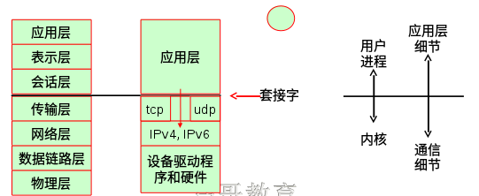
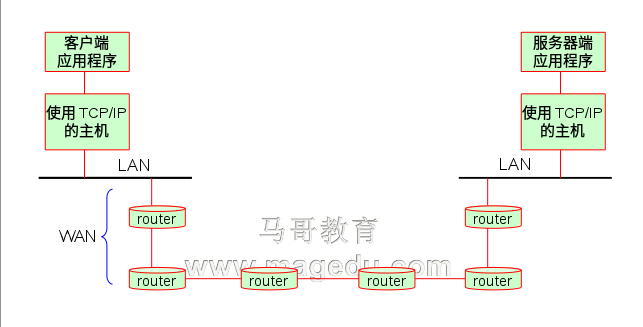

## OSI七层参考模型：
##	资源子网：实现某种特定功能；
- 应用层
- 表示层
- 会话层

##	通信子网： 通用功能，故而在内核中实现；
- 传输层：
	提供进程地址，Port Number：
>		tcp：Transport Control Protocol 传输控制协议，面向连接的协议；通信前需要建立虚拟链路；结束后拆除链路；http，ssh
			端口范围：0-65535
>		udp：User Datagram Protocol，无连接的协议；类似于邮政系统；DNS，即时通信软件等；
			端口范围：0-65535
- 网络层：IP标记主机到主机；
- 数据链路层：MAC标记设备到设备；只要没遇到NAT服务器，SourceIP和DesinationIP都是不变的；
- 物理层
		
## TCP/IP模型
-	应用层：对应OSI 的上三层；
-	传输层：TCP，，UDP，套接字；
-	网络层：IPv4，IPv6
-	物理层：设备驱动程序和硬件；对应OSI的数据链路层和物理层；
	
如下图所示：

###**Socket： **
>	IPC的一种实现，允许位于不同主机(甚至同一主机)上的不同进程之间进行通信，从而完成数据交换；
	Socket API，1983年；最早出现在4.2版的BSD上；

#### Socket Types:	
- SOCKET_STREAM： tcp套接字；
- SOCKET_DGRAM: udp套接字；
- SOCKER_RAW：裸套接字；

**跨Internet的主机间通信：	**

MTU： 最大传输单元；
较老的路由设备：将再次IP分片；

###**IPv4分类：**
- A：1-127
- B：127-191
- C：192-223
- D：组播，224-239
- E：240-254
	
###**私有地址：**
- A：10.0.0.0/8
	127.0.0.0/8
- B：172.16.0.0/16-172.31.0.0/16
- C：192.168.0.0/24-192.168.255.0/24
	
	
##传输层 Port Number：
####**IANA：**
		0-1023：众所周知，永久的分配给固定的应用使用，特权端口，只有管理员能使用；22/tcp(ssh),80/tcp(http),443/tcp(https)
		1024-41951: 亦为注册端口，但要求不是特别严格；分配给程序注册未某应用使用，11211/tcp，11211/udp(memcached),3306/tcp(mysql)
		41952+ : 客户端程序随机使用的端口；被称为动态端口或私有端口；其范围的定义：/proc/sys/net/ipv4/ip_local_port_range
		
		
### TCP协议的特性：
- 建立连接：三次握手；
- 数据打包成段，校验和(CRC-32)
- 确认、重传以及超时；
- 排序：逻辑序列号
- 流量控制： 防止快发慢收的情况，导致接收端丢失数据；使用滑动窗口算法实现；
- 拥塞控制： 慢启动和拥塞避免算法；

	
### Socket Domain：(根据其所使用的地址)
- AF_INET: Address Family,IPv4
- AF_INET6: IPv6
- AF_UNIX: 同一主机上的不同进程之间通信时使用；	
每类套接字都至少提供了两种socket： 流，数据报；
	流： 可靠地传输、面向连接、无边界；
	数据报： 不可靠地传递、有边界、无连接；
	
###套接字相关的系统调用：
- socket(): 创建一个套接字；
- bind(): 使用套接字，绑定；
- listen() : 监听套接字；
- accept(): 接收请求；
- connect() : 请求连接建立；
- write() : 发送数据，往套接字文件写数据；
- read() : 接收数据，从缓冲中接收数据:
	send(),recv(),sendto(),recvfrom()
	
	

# http协议：hyper text transfer protocol,80/tcp
## html 超文本标记语言；hyper text mark language

~~~html
<html>
	<head>
		<title>TITLE</title>
	</head>
		<h1>hello<h1>
			
 blabla... <a href="https://www.google.com"> blabla... </a> 

		<h2>html<h2>	
	<body>
	</body>
</html>
~~~
	
### CSS: Cascading Style Sheet	
### JS: javascript,脚本编程语言，客户端脚本；
	
### MIME： Multipurpose Internet Mail Extesion,早期为smtp协议设计；

### http工作机制：
- http请求；
- http响应；
	
### Web资源： web resource；
- 静态文件：.html，.gif, .txt, .js , .css, .mp3,  .avi;
- 动态文件：php,asp,jsp等；
	
**媒体：**
媒体类型(MIME类型）：major/minor
- text/html
- text/plain
- image/jpeg
- image/gif
..........
			
		
### URI : Uniform Resource Identifier ，统一资源标识符；
####	URL： Uniform Resource Locator：统一资源定位符；
- 功能：用来描述某服务器某特定资源的位置；
- 格式：Scheme://Server:Port/path/to/resource
- Example: http://www.google.com/images/logo.gif

####	URN: Uniform Resource Naming,统一资源命名符；
		
### http 协议版本：
- HTTP/0.9: 原型版本，存在严重缺陷，功能简陋；
- HTTP/1.0: 真正广泛使用；开始支持MIME机制；http协议大爆发；
- HTTP/1.1: 增强了缓存功能；	
- spdy: Google研发，加速浏览过程；已放弃支持；转投HTTP/2.0
- HTTP/2.0: 未来趋势；

	
### 一次完整的http请求响应过程
- 建立或处理连接：接收请求或拒绝请求；	
- **接收请求**：读取到客户端的http请求报文；
	接收来自于网络的请求报文中对某资源的一次请求的过程；
	**并发访问响应模型(Web I/O):**
>		单进程I/O结构：启动多个进程处理用户请求，而且一次只处理一个，多个请求被串行响应；
>		多进程I/O结构：并行启动多个进程，每个进程响应一个请求；
>		复用I/O结构：一个进程响应N个请求：
   			多线程模型：一个进程生成N个线程，每个线程响应一个用户请求；
  			事件驱动：event-driven;
>		复用的多进程I/O结构：启动多个(m)进程，每个进程响应n个请求，能响应m*n个请求；		
- 处理请求： 对http报文进行解析,并获取请求的资源及请求方法等相关信息；
>	元数据：请求报文首部：
~~~html
		<method> <URL> <VERSION>
		Host: www.baidu.com	请求的主机名称
		Connection：
~~~

>  **连接分两种：**
>	持久连接：某个页面由多个web资源构成，在请求获得web资源后不断开TCP连接，继续请求剩余的web资源；
>	非持久连接：在请求获得当前请求的web资源后，断开TCP连接，下次请求资源时重新建立TCP连接；
	
- 访问资源： 获取请求报文中请求的资源；
>	web服务器:

>		即存放了web资源的服务器，负责向请求者提供对方请求的静态资源，或动态资源运行后生成的资源；
		这些资源放置于本地文件系统某路径下，此路径通常称为DocRoot；
		/var/www/html/
			images/1.html
		http://www.baidu.com/images/1.html

	web服务器的路径映射：
		1. DocRoot
		2. 路径别名映射
		3. 虚拟主机docroot
		4. 用户加目录docroot
	

- 构建响应报文：将资源打包封装成http响应报文；
>**资源的MIME类型：**
	显式分类；
	魔法分类
	协商分类

>**URL重定向：**web服务构建的响应并非客户端请求的资源，而是资源另外一个访问路径；
	永久重定向：资源已经被永久移动到新的路径；
	临时重定向：资源被临时移动；
	错误重定向：
	负载均衡	
		
- 发送响应报文：
	http的连接是双向通道，将构建好的http报文，通过server的发送缓冲，发送到client端的接收缓冲；
	
- 记录日志： 以便进行用户行为分析，方便投放广告；

	
	
## http服务程序：
- httpd(apache)
- nginx
- lighttpd

## 应用程序服务器：
- IIS

以下都是jsp的应用程序服务器了；
- Tomcat
- jetty

- jboss
- resin

- websphere: IBM
- weblogic: BEA收购；
- oc4j : oracle,收购了BEA公司，weblogic也属于oracle了；

http://www.netcraft.com  挖掘，统计，分析；

			

	
	
	
	
	
	
	
	
	
	
	
	
	
	
	
	
	
	
	
	
	
	
	
	
	
	
	
	
	
	
