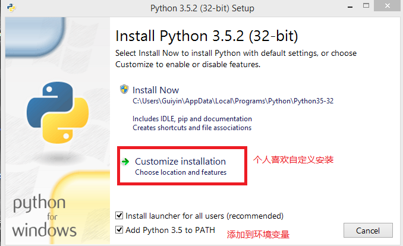
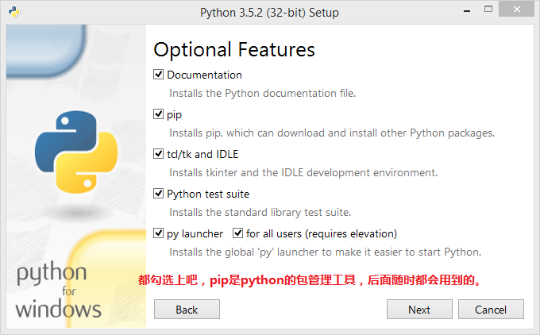
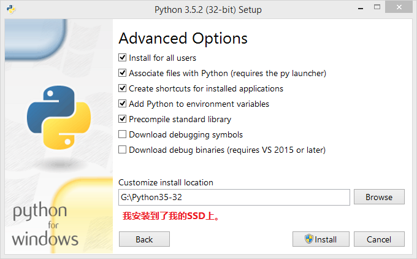
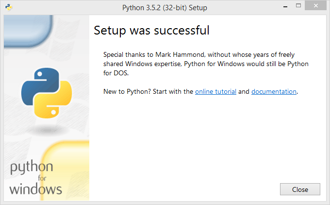
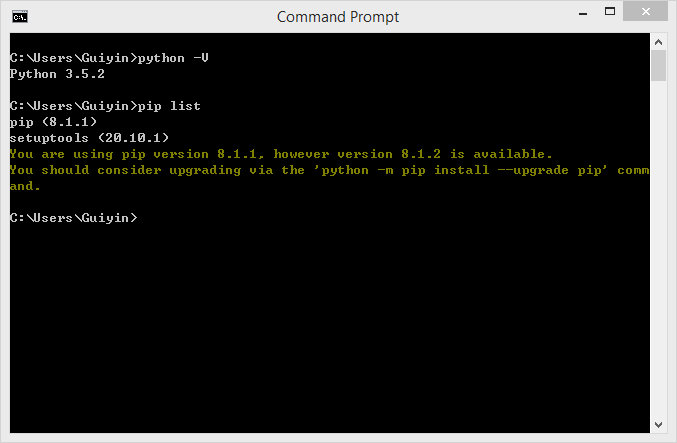

# 准备python学习环境：

目录

* [Windows安装Python](#windows安装python)
* [linux安装Python](#linux安装python)

[Python解释器下载地址](https://www.python.org/downloads/)

关于如何选择Python的版本，官方给出了Python2和Python3的差异：

[Python2和Python3的差异](https://wiki.python.org/moin/Python2orPython3)

**************************正文开始：*******************************************

windows安装python

[下载Python 3.5.2](https://www.python.org/ftp/python/3.5.2/python-3.5.2.exe)

安装Python：

接下来，您就可以使用各种文本编辑器或者IDE开始编写Python程序了；

sublime text 3、
GVim、
Pycharm；

[返回目录](#目录)

linux安装python

Linux平台上关于Python的安装就不多费唇舌了，大多数Linux发行版都已经自带了Python解释器；

如若不然，请自行安装：

- RHEL/CentOS:	yum install python-VERSION

- Fedora:			dnf install python-VERSION

- Ubuntu:			apt-get install python-VERSION

### 终极办法，源代码编译安装：

[源代码下载地址](https://www.python.org/ftp/python/3.6.0/Python-3.6.0b1.tar.xz)

至于具体编译安装的步骤，请自行Google；

[返回目录](#目录)

